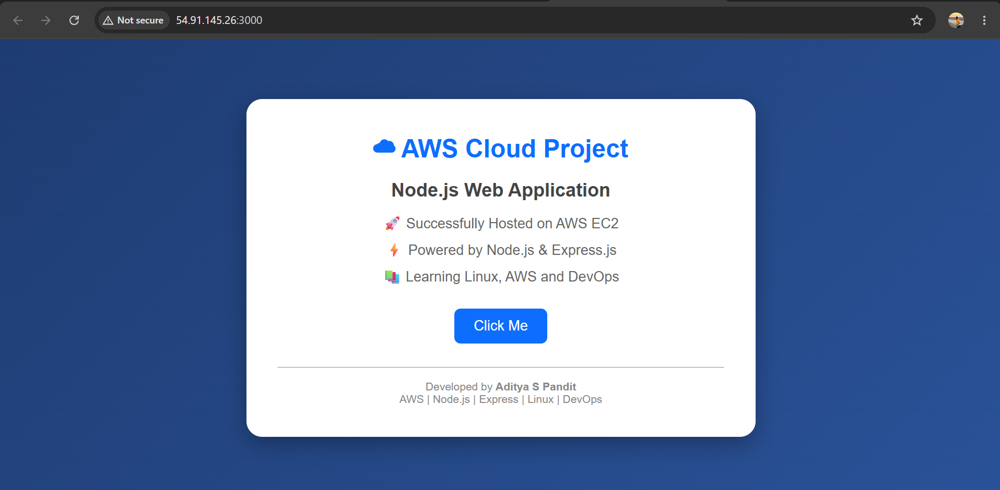

# ☁️ AWS EC2 Node.js Web Application

A Node.js web application successfully deployed and hosted on an
AWS EC2 Linux instance using Node.js and Express.js.

---

---

## 🚀 Project Overview

This project demonstrates the deployment of a Node.js web application
on an AWS EC2 instance.

The application was developed using Node.js and Express.js and
accessed through the EC2 public IP on port 3000.

---

## 🛠️ Technologies Used

- Node.js
- Express.js
- Linux
- AWS EC2
- Git / Git Bash
- HTML
- CSS

---

## ✨ Features

- Node.js web application
- Express.js server
- Professional web interface
- Hosted on AWS EC2
- Runs on port 3000
- Accessible using EC2 public IP
- Responsive web design

---

## 📁 Project Structure

```text
aws-nodejs-ec2-project/
│
├── app.js
├── package.json
├── README.md
│── Node-js.png
```


## 📸 Project Screenshot


## Author
**Aditya Pandit**

cloud computing student
